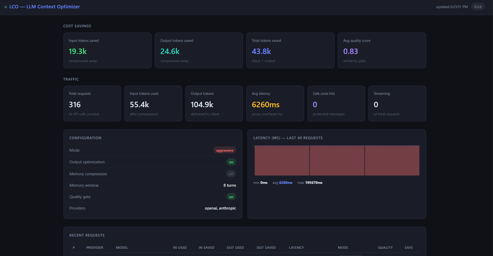
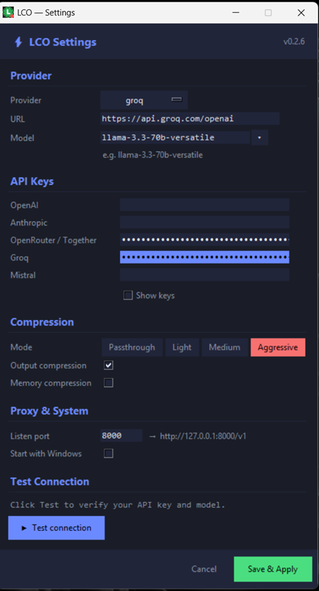

# LCO — LLM Context Optimizer v0.2.6

> LCO sits directly between your favorite AI app and your LLM API, invisibly cutting token costs and latency by **65%+**.

---

[](https://github.com/powergr/lco/actions/workflows/release.yml)
[](https://github.com/powergr/lco/releases)
[](https://github.com/powergr/lco/blob/master/LICENSE)
[](https://github.com/powergr/lco/releases)


## [](https://github.com/powergr/lco)




Works instantly with **Chatbox, Cursor IDE, Obsidian, TypingMind**, or _any_ OpenAI-compatible client. No code changes required!

---

## Quick start

```bash
pip install -r requirements.txt
python3 install.py          # one-time: registers lco as importable package

# Option A — tray app (recommended, no terminal needed)
python3 tray.py

# Option B — CLI
python3 cli.py start --openai-url https://api.groq.com/openai --mode aggressive --output-on
```

Point your client at LCO:

```python
# OpenAI SDK / Chatbox / Cursor IDE Base URL
client = OpenAI(api_key="your-key", base_url="http://127.0.0.1:8000/v1")

# Anthropic SDK
client = Anthropic(api_key="sk-ant-...", base_url="http://127.0.0.1:8000")

# Claude Code
ANTHROPIC_BASE_URL=http://127.0.0.1:8000 claude
```

---

## How it works

LCO achieves massive cost reductions without requiring heavy GPUs or PyTorch installations. It uses a lightning-fast, `<5ms` local pipeline:

1. **Pre-generation Prevention:** Intelligent prompt injection stops the LLM from generating expensive filler text ("yap") before it even starts.
2. **Input Compression:** Fast mathematical TF-IDF extractive compression shrinks your massive conversation histories without losing context.
3. **Output Scrubbing:** Regex and token-budgeting strips useless boilerplate (e.g., "Certainly! Here is the code:") before it reaches your UI.

```ascii
Your app ──► LCO proxy (localhost:8000) ──► Upstream LLM API
                        │
          ┌─────────────▼──────────────────┐
          │ 1. Memory compression (LCO-7)  │ compress old turns
          │ 2. Input cleaner    (LCO-3)    │ remove boilerplate
          │ 3. Semantic compress (LCO-5)   │ sentence extraction
          │ 4. Pre-generation Opt          │ anti-yap injection
          │ 5. Quality gate     (LCO-4)   │ similarity check
          │ 6. Forward to upstream         │
          │ 7. Output compress  (LCO-6)   │ strip boilerplate
          │ 8. Output quality gate         │ safety check
          └────────────────────────────────┘
```

Default mode is `passthrough` — zero compression, 100% compatible.

---

## Tray app (recommended)

The tray app runs completely without a terminal. Double-click `LCO.exe`
(Windows) or `LCO.app` (macOS) and a custom tray icon appears.

### Install dependencies (source only — not needed for .exe/.app)

```bash
pip install pystray Pillow
# Linux only:
sudo apt install python3-tk libappindicator3-1
```

### Data files location

All data is stored in a platform-appropriate folder — never beside the exe:

| Platform | Location                             |
| -------- | ------------------------------------ |
| Windows  | `%APPDATA%\LCO\`                     |
| macOS    | `~/Library/Application Support/LCO/` |
| Linux    | `~/.local/share/LCO/`                |

Contents: `settings.json`, `lco_metrics.db`, `lco.log`

### Tray features

**Right-click menu:**

- 💰 Live "X saved this session" counter
- Mode switcher (Off / Light / Medium / Max)
- Output compression toggle (saved immediately)
- 📊 Status & Savings popup
- ⚙ Settings window
- 🌐 Open Dashboard

**Status popup:**

- Session and all-time dollar savings
- Token breakdown (input saved / output saved / total requests)
- **📋 Copy proxy URL** — one click copies `http://127.0.0.1:8000/v1`
- Mode buttons and output toggle
- Link to Settings and Dashboard

**Settings window:**

- Provider selector with auto-fill URL
- **Separate API key fields** for every provider (OpenAI, Anthropic,
  OpenRouter, Groq, Mistral) — stored securely and **auto-saved as you type**.
- Show/hide all keys toggle
- Model dropdown (pre-populated per provider) + free-text override
- **▶ Test connection** — instantly tests routing to your specific provider and shows latency
- Compression mode, output compression, memory compression
- Listen port + **Start with Windows** checkbox (Windows only)
- Save & Apply — applies runtime settings immediately, no restart needed

### UX safety features

| Feature                     | Behaviour                                                                  |
| --------------------------- | -------------------------------------------------------------------------- |
| **Single instance**         | If LCO is already running, shows a notification and exits cleanly          |
| **Port conflict detection** | If port 8000 is taken, offers to use the next free port automatically      |
| **Startup failure dialog**  | If proxy doesn't start within 10s, shows an error dialog with instructions |
| **First-run wizard**        | Settings window opens automatically on first launch                        |

---

## Packaging as a standalone app

```bash
pip install pyinstaller

# Detects platform automatically
python3 build.py
```

**Windows** → `dist\LCO.exe` (single file, no installer needed, custom `.ico` supported)

**macOS** → `dist/LCO.app` (drag to Applications)

**Linux** → `dist/LCO` (standalone binary)

### Windows installer (NSIS)

Produces `LCO-Setup-0.2.6.exe` with Start Menu, Desktop shortcut,
Add/Remove Programs entry, and Windows startup registration.

```bash
# Install NSIS: https://nsis.sourceforge.io
python3 build.py          # build LCO.exe first
makensis installer.nsi   # build the installer
```

---

## CLI reference

```bash
python3 cli.py start --openai-url http://localhost:11434 --mode aggressive --output-on
python3 cli.py status
python3 cli.py mode aggressive
python3 cli.py output on
python3 cli.py memory on
python3 cli.py gate threshold 0.15
python3 cli.py metrics
python3 cli.py metrics --reset
python3 cli.py stop
```

---

## Supported providers

| Provider        | Upstream URL                  | Notes                       |
| --------------- | ----------------------------- | --------------------------- |
| **Ollama**      | `http://localhost:11434`      | No API key needed           |
| **OpenAI**      | `https://api.openai.com`      |                             |
| **Anthropic**   | `https://api.anthropic.com`   | Uses separate anthropic key |
| **OpenRouter**  | `https://openrouter.ai/api`   | Access to all models        |
| **Groq**        | `https://api.groq.com/openai` | Blazing fast inference      |
| **Mistral**     | `https://api.mistral.ai`      |                             |
| **Together AI** | `https://api.together.xyz`    |                             |
| **DeepSeek**    | `https://api.deepseek.com`    |                             |

---

## Benchmark

LCO ships with a rigorous 12-conversation benchmark suite covering real-world scenarios.

```bash
python3 benchmark.py --mode aggressive --model llama-3.3-70b-versatile
python3 benchmark.py --mode aggressive --verbose   # show input + savings
python3 benchmark.py --dry-run                     # estimate, no LLM needed
```

Typical results (aggressive mode): **60–75% total token reduction**

| Category         | Average Reduction |
| ---------------- | ----------------- |
| Customer Support | 60–70%            |
| Data Analysis    | 65–75%            |
| Documentation    | 60–70%            |
| Coding Assistant | 55–70%            |

---

## Response headers

Every proxied request includes:

| Header               | Meaning                    |
| -------------------- | -------------------------- |
| `x-lco-mode`         | Active compression mode    |
| `x-lco-input-saved`  | Input tokens removed       |
| `x-lco-output-saved` | Output tokens scrubbed     |
| `x-lco-safe-zones`   | Messages protected         |
| `x-lco-provider`     | Detected upstream provider |

---

## Project structure

```aascii
lco/
├── tray.py                 ← standalone tray app (main entry point)
├── cli.py                  ← CLI: start · stop · mode · metrics
├── build.py                ← package as .exe / .app / binary
├── build_windows.spec      ← PyInstaller Windows spec (no UPX)
├── installer.nsi           ← NSIS Windows installer script
├── main.py                 ← FastAPI app factory
├── version.py              ← single version source of truth
├── adapters.py             ← all 11 providers in one file
├── config.py               ← settings (env-var driven)
├── benchmark.py            ← 12-conversation true A/B benchmark
├── view_metrics.py         ← terminal metrics viewer
│
├── proxy/
│   ├── router.py           ← full compression pipeline & injection
│   ├── safe_zones.py       ← code/JSON/tool-call exclusion
│   ├── buffer.py           ← robust SSE streaming buffer
│   ├── cleaner.py          ← boilerplate removal
│   ├── compressor.py       ← TF-IDF sentence extraction
│   ├── llm_compressor.py   ← Ollama summarisation
│   ├── output_optimizer.py ← output compression
│   ├── memory.py           ← memory compression
│   ├── quality_gate.py     ← TF-IDF + Ollama similarity gate
│   └── dashboard.py        ← web dashboard HTML
│
├── storage/metrics.py      ← SQLite metrics
├── middleware/metrics.py   ← request timing
│
└── tests/                  ← 174 passing tests
```

---

## Compression modes

| Mode          | What it does                              | Risk       | Reduction |
| ------------- | ----------------------------------------- | ---------- | --------- |
| `passthrough` | No compression                            | None       | 0%        |
| `light`       | Boilerplate removal + dedup               | Very low   | 15–25%    |
| `medium`      | Light + sentence extraction               | Low        | 30–45%    |
| `aggressive`  | Medium + Strict Anti-Yap Prompt Injection | Low–medium | 60–75%    |

---

## Quality gate

The Quality Gate acts as a safety net. If compression degrades the meaning of a response too heavily, LCO dynamically aborts the compression and serves the original, unadulterated text.

| Embedder          | Threshold | Use case               |
| ----------------- | --------- | ---------------------- |
| `tfidf` (default) | `0.15`    | No deps, fast, offline |
| `ollama`          | `0.80`    | Better accuracy        |
| `null`            | —         | Disable gate           |

---

## Running tests

```bash
pytest tests/ -v                   # all tests
pytest tests/ -v -m "not ollama"   # skip Ollama tests
```

Expected without Ollama: **174 passed, 12 skipped**

---

## Roadmap

| Feature                                  | Status |
| ---------------------------------------- | ------ |
| Proxy core + pipeline (LCO 1–7)          | ✅     |
| 11 provider adapters                     | ✅     |
| Web dashboard                            | ✅     |
| System tray / menu bar app               | ✅     |
| Settings persistence (no CLI needed)     | ✅     |
| Separate API keys per provider           | ✅     |
| Connection test in Settings              | ✅     |
| Pre-generation Yap Prevention            | ✅     |
| Single instance guard                    | ✅     |
| Port conflict detection                  | ✅     |
| Startup failure notification             | ✅     |
| Proxy URL copy button                    | ✅     |
| Windows installer (NSIS)                 | ✅     |
| Windows .exe / macOS .app / Linux binary | ✅     |
| Length-adaptive output quality gate      | V2     |
| Toast notifications (savings milestones) | V2     |
| Auto-update check                        | V2     |
| PyPI package                             | V2     |
| Docker image                             | V2     |

---

## License

MIT
